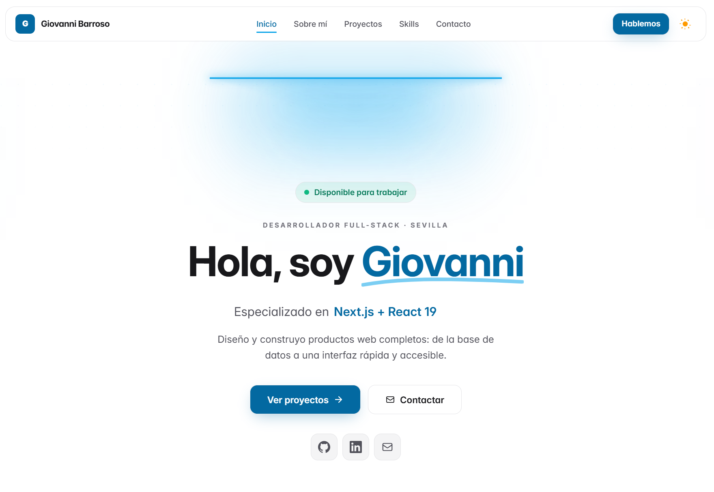

# Portfolio — Giovanni Barroso

Portfolio personal desarrollado con **Vue 3 + TypeScript + Tailwind CSS 4**, desplegado en [giovannibarroso.com](https://giovannibarroso.com).

[](https://github.com/GiovanniBarroso/mi-portfolio/actions/workflows/ci.yml)



## Stack

- **Vue 3.5** (Composition API + `<script setup>`) con **TypeScript**
- **Vite 7** como bundler y dev server
- **Tailwind CSS 4** con modo oscuro
- **Vue Router** con rutas lazy-loaded
- **@vueuse/motion** para animaciones
- **Unhead** para SEO dinámico (title, meta, canonical, Open Graph)
- **PWA** con manifest y service worker

## Estructura

```
src/
├── components/    # Componentes comunes y de layout (Navbar, LampHero, Footer…)
├── composables/   # Lógica reutilizable (SEO, clipboard, carousel…)
├── config/        # Configuración de SEO del sitio
├── data/          # Contenido: proyectos, skills, about, contacto
├── plugins/       # Tema claro/oscuro
├── router/        # Rutas con lazy loading
└── views/         # Home, Proyectos, Skills, Sobre mí, Contacto
```

Todo el contenido (proyectos, skills, textos) vive en `src/data/`, separado de los componentes: para actualizar el portfolio basta con editar esos ficheros.

## Desarrollo

Requiere Node ≥ 18 y pnpm ≥ 9.

```bash
pnpm install      # instala dependencias
pnpm dev          # servidor de desarrollo
pnpm build        # build de producción en dist/
pnpm preview      # previsualiza la build
```

### Calidad de código

```bash
pnpm lint         # ESLint (máx. 0 warnings)
pnpm format       # Prettier
pnpm typecheck    # vue-tsc
pnpm ci:check     # lint + typecheck + build (lo que ejecuta CI)
```

Husky + lint-staged formatean y lintan automáticamente en cada commit.

## Despliegue

CI/CD con GitHub Actions: cada push a `main` pasa por `ci.yml` (lint + typecheck + build) y `deploy.yml` publica la build en GitHub Pages con el dominio personalizado `giovannibarroso.com`.
